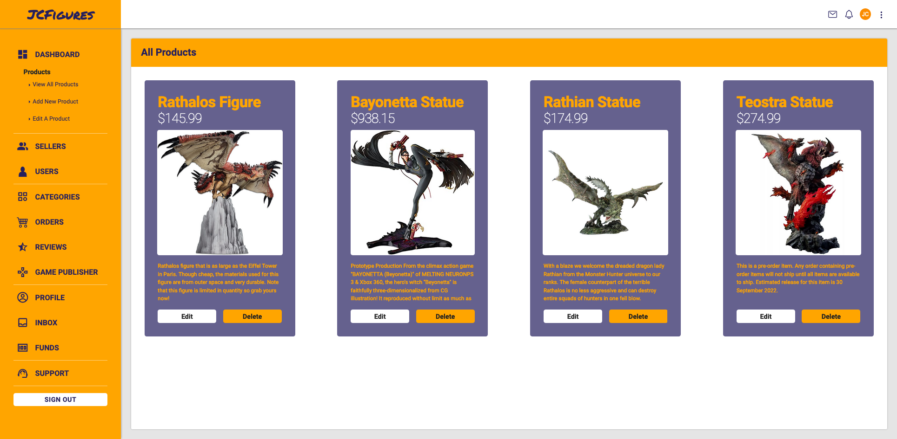

# JCFigures Store React

    
Table of Contents

    <ol>
        <li>
            <a href="#about-the-project">About The Project</a>
            <ul>
                <li><a href="#things-i-used">Things I used</a></li>
            </ul>
        </li>
        <li><a href="#features">Features</a></li>
        <li><a href="#roadmap">Roadmap</a></li>
    </ol>

<!-- All information here -->

## About The Project

[![JCFigures Login Page][login-page-sc]](https://jcfigures-react.netlify.app/)

JCFigures is a site dedicated in selling famous and high quality statues and figurines of some of the best characters in video games. Now built with React!

<!-- 
(<a href="#top">back to top</a>)
 -->

## Things I used

-   [React](https://reactjs.org/)
-   [Firebase](https://firebase.google.com/)
-   [Styled Components](https://styled-components.com/)
-   [React Toastify](https://fkhadra.github.io/react-toastify/introduction)
-   [React Bootstrap (for checkbox only)](https://react-bootstrap.github.io/)
-   [React Icons](https://react-icons.github.io/react-icons/)
-   [Browser Router](https://v5.reactrouter.com/web/api/BrowserRouter)

<!-- 
(<a href="#top">back to top</a>)
 -->

## Features

-   Invalid Email or Password combination shows a toast on top center of the screen.
-   Custom 404 and protected dashboard
-   On user signout, session is terminated.
-   Everything is styled with styled-components
-

<!-- 
(<a href="#top">back to top</a>)
 -->

<!-- roadmap -->

## Roadmap

-   [x] Added hover transition links
-   [x] Prepopulate fields in edit.html
-   [ ] Add CRUD functionality
-   [ ] Sidebar links connected by browser router
-   [ ] Responsive design

These are the currently planned changes.

(<a href="#top">back to top</a>)

<!-- markdown images -->

[login-page-sc]: user-images/login-page-sc.png
